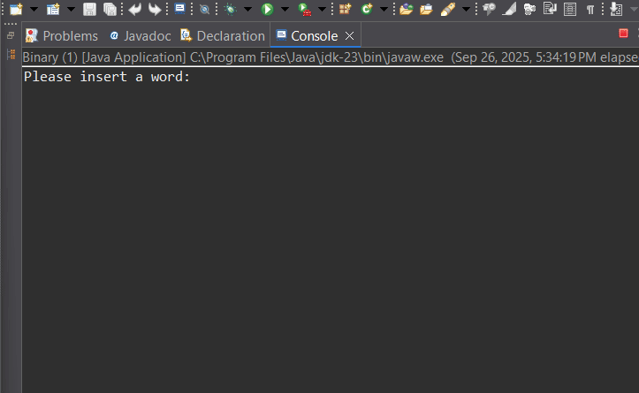

## Demo

Through the execution examples in the demo it is realized:

1. Valid binary string (mixed 0/1):
The result true confirms that the character-character scan check found only '0' and '1', so the behavior is correct and expected.
2. Only 0:
Confirms that the method correctly handles sequences with repeated same digit and does not require a variety of characters.
3. Only 1:
Corresponds to the previous scenario; indicates that there is no bias towards '0' and that either of the two allowed characters accepts input.
4. Contains other digital characters (e.g. 2):
The result false is correct: any digital character other than '0'/'1' aborts the check and returns an immediate rejection result.
5. Contains letters:
Indicates that non-digital characters (alphabet) are detected and rejected, as expected for a binary check.
6. Contains spaces within the string:
False indicates that whitespace characters are considered invalid.
7. Contains symbols (e.g. - or .):
Confirms that symbols and punctuation are rejected.
8. Input with leading/trailing spaces (trailing space):
False indicates that leading/trailing spaces are not automatically ignored.
9. Large binary string:
True for large input confirms that the algorithm operates linearly along the input.

What this program does:

• Reads a word or string from the user.

• Checks character by character whether all characters are '0' or '1'.

• Returns and displays a logical result to the user: if the string is binary it returns true otherwise it returns false.

Code Notes:

• Main method: public static void main(String[] args) uses Scanner to read a line.

• Helper method: public static boolean isBinary(String str) performs a character-by-character check and returns false on the first invalid character, otherwise returns true.

Suggestions for improvement (for future development):

• Add a check for empty input and corresponding message.

• Support for removing whitespace or choosing to ignore it.

• GUI or CLI options (e.g. file check).

• Unit tests (JUnit) for automatic functionality verification.
